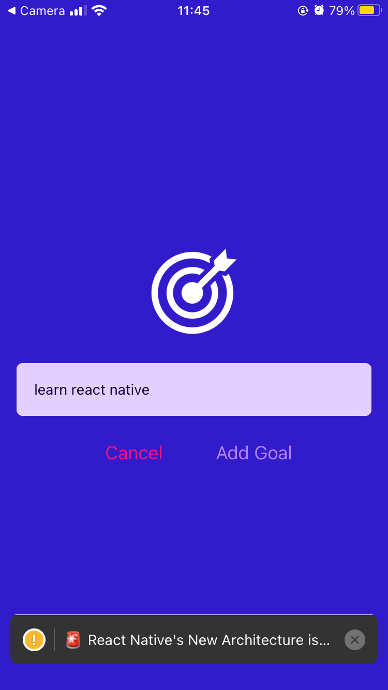
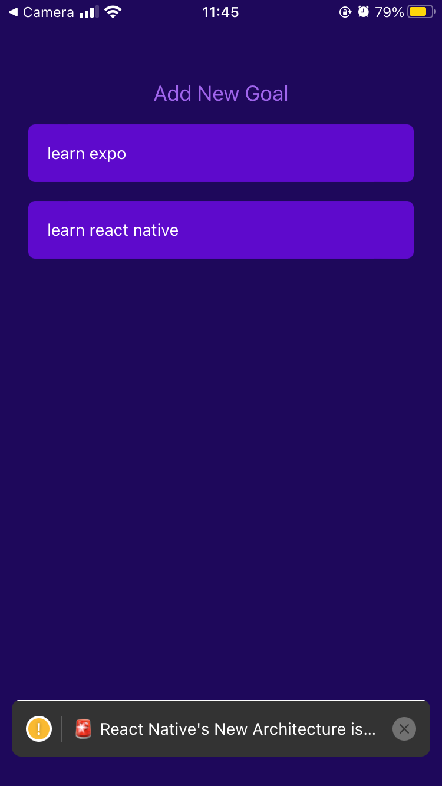

# React Native Goals App

This is a simple React Native application that allows users to add, and view. The app demonstrates how to handle user input, manage state, and display a list of items using React Native components such as `Button`, `TextInput`, `FlatList`, and custom components.

## Features

- **Add new goals**: Users can add new goals by entering text and clicking the "Add New Goal" button.
- **View goals**: All goals are displayed in a list with each goal's text.

## Technologies Used

- React Native
- React Navigation (optional for future navigation additions)
- Expo
- `react-native-safe-area-context` for managing safe area views

## Installation

1. Clone this repository:
   ```bash
   git clone https://github.com/yourusername/react-native-goals.git

## Screenshots




